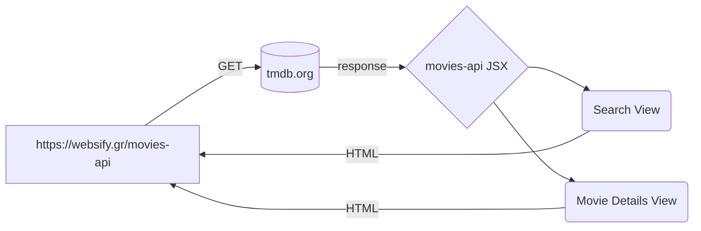

> # websify.gr-movies-api 
 >> ### `test it on` [websifyGR](https://websify.gr/movies-api/)
 
> ## REACT.js
>> ### `consuming data from `  [tmdb.org](https://www.themoviedb.org/) 

    #

> API based movie browser from a REACT.js Bootcamp. There is a direct search feature on top, a Movie Details view, all integrated into a single page application / progressive web application. 

    #

> **`version : 0.1.0`**
> **`author : Charis Chrysochoou`**
>> **`npm -v : 8.19.3`**
>> **`node -v : v16.19.1`**
>> **`git -v : 2.39.2.windows.1`**

    #

> **#TODO**
 >>- [1] **modal popup for movie details**
 >>- [2]  **REST for Youtube movie trailer if any**
 >>- [3] **modal popup for Youtube movie trailer**
    #
>## `Code Flow Diagram`

